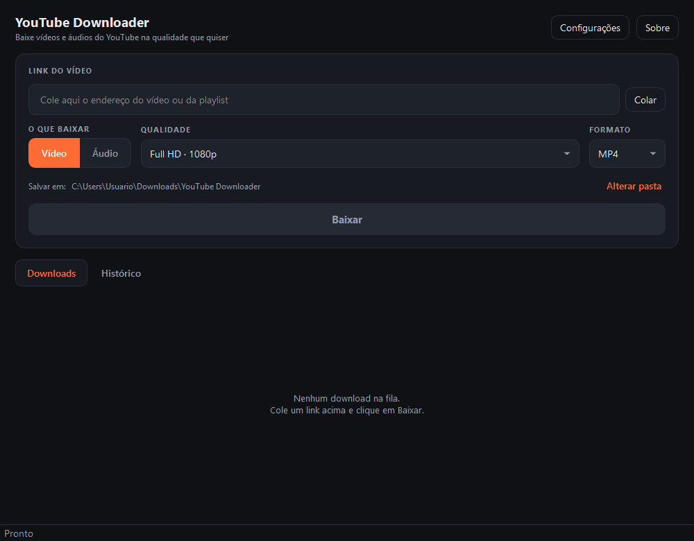

<div align="center">

# YouTube Downloader

**Baixe vídeos e áudios do YouTube e de mais de mil outros sites.**

[](https://github.com/victorhuggomed2006-ux/YoutubeDownloader/actions/workflows/ci.yml)
[](https://github.com/victorhuggomed2006-ux/YoutubeDownloader/releases/latest)
[](source-code/LICENSE)

### [⬇️ Baixar o instalador](YouTubeDownloader-1.2.0-Setup.msi)

*96 MB · Windows 10 ou 11 de 64 bits*



</div>

---

## Como instalar

Clique no link acima e depois no botão **Download** da página do arquivo. Dê
dois cliques no que baixar, escolha se quer o atalho na Área de Trabalho e
conclua.

**Não pede permissão de administrador** e não exige instalar Python, FFmpeg nem
qualquer outra coisa — está tudo dentro do instalador.

O programa vai para `%LOCALAPPDATA%\Programs\YouTube Downloader`, a pasta que o
Windows reserva para programas de um único usuário, e é justamente isso que
permite dispensar a tela de permissão. É o mesmo lugar em que Chrome, Discord e
Spotify se instalam.

> **Aviso do Windows:** o instalador ainda não tem assinatura digital, então o
> SmartScreen mostra *"O Windows protegeu o seu computador"*. Clique em **Mais
> informações → Executar assim mesmo**. Isso acontece com qualquer programa não
> assinado; o [plano para resolver](source-code/docs/ASSINATURA.md) está
> documentado.

Para desinstalar: **Configurações → Aplicativos → Aplicativos instalados**.

## O que ele faz

Vídeo em **MP4, MKV ou WebM**, de 360p a 4K, com o áudio já mesclado. Áudio em
**MP3, M4A, Opus, WAV ou FLAC**, de 128 a 320 kbps.

Cole um link e o programa mostra miniatura, título, canal e duração antes de
você decidir. A fila aceita vários downloads ao mesmo tempo, com progresso real,
velocidade, tempo restante e cancelamento. Playlists entram de uma vez.

O arquivo final leva capa e metadados, e legendas quando você pedir. Há
histórico dos downloads, temas claro e escuro, e a interface fala português e
inglês.

**Não se limita ao YouTube.** Qualquer endereço `http`/`https` é repassado ao
yt-dlp, que suporta [mais de mil sites](https://github.com/yt-dlp/yt-dlp/blob/master/supportedsites.md)
— Vimeo, Twitch, SoundCloud, Reddit, Bandcamp e outros.

### Vídeos que exigem conta conectada

Restrição de idade, conteúdo de membros e o pedido de *"confirme que você não é
um robô"* precisam de sessão autenticada. Em **Configurações → Usar cookies do
navegador**, escolha o navegador em que você já está logado e **feche-o** antes
de baixar — enquanto aberto, ele mantém o arquivo de cookies travado.

### O que mantém tudo funcionando

Os sites mudam a forma de servir vídeo o tempo todo, e quem acompanha isso é o
yt-dlp. Uma cópia congelada dentro do programa envelheceria em poucos meses, e
por isso o aplicativo verifica ao abrir se há versão mais nova e oferece
atualizá-la — direto do PyPI, com verificação SHA-256, na sua pasta de usuário.

Se um vídeo específico parar de baixar, atualizar o motor é a primeira coisa a
tentar.

## O código

Está em **[`source-code/`](source-code)** — implementação, testes, empacotamento
e toda a documentação técnica.

| | |
|---|---|
| [Arquitetura do código](source-code/README.md) | como o projeto é organizado por dentro |
| [Documentação completa](source-code/README.pt-BR.md) | recursos, compilação, limitações |
| [English documentation](source-code/README.en.md) | full documentation in English |
| [Contribuir](source-code/CONTRIBUTING.md) | ambiente, convenções, como enviar mudanças |
| [Segurança](source-code/SECURITY.md) | onde o risco está e como reportar |
| [Histórico de versões](source-code/CHANGELOG.md) | o que mudou em cada release |

Compilar do zero é um comando só:

```powershell
cd source-code
powershell -ExecutionPolicy Bypass -File packaging\build.ps1
```

Ele cria o ambiente, baixa o FFmpeg, gera ícones e traduções, roda os 142 testes
e produz o instalador.

## Licença

Feito por **Victor Medeiros** — Analista de TI, Desenvolvedor, Engenheiro de IA.

Copyright © 2026 Victor Medeiros. [Licença MIT](source-code/LICENSE).

Construído sobre [yt-dlp](https://github.com/yt-dlp/yt-dlp) (Unlicense),
[Qt/PySide6](https://www.qt.io/qt-for-python) (LGPL v3) e
[FFmpeg](https://ffmpeg.org) (LGPL v2.1+).

## Uso responsável

Baixe apenas o que você tem direito de guardar: material próprio, obras em
domínio público, conteúdo sob licença aberta ou mídia que você tem permissão
para salvar. Respeite os termos de serviço de cada site e a legislação de
direitos autorais aplicável.
