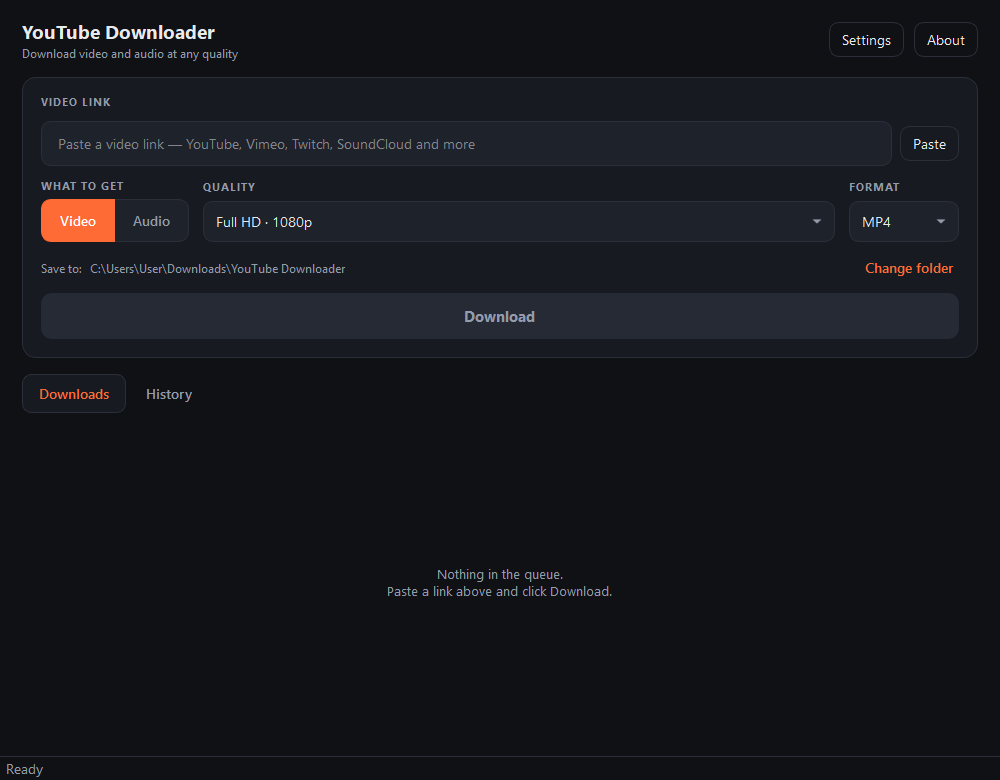

<div align="center">

# YouTube Downloader — documentação técnica

[Instalação](docs/INSTALLING.md) · [Arquitetura](docs/ARCHITECTURE.md) · [Contribuir](CONTRIBUTING.md) · [Segurança](SECURITY.md) · **[English](README.md)**



</div>

---

Aplicativo desktop para Windows feito em PySide6. O instalador traz o FFmpeg e
o motor de download embutidos, então quem usa não precisa de Python nem de
qualquer outra dependência.

As instruções de instalação estão na [página inicial do projeto](../README.md).

## Recursos

Vídeo em **MP4, MKV ou WebM**, de 360p a 4K, com o áudio já mesclado. Áudio em
**MP3, M4A, Opus, WAV ou FLAC**, de 128 a 320 kbps.

Cole um link e o programa mostra miniatura, título, canal e duração antes de
você decidir. A fila aceita vários downloads ao mesmo tempo, com progresso
real, velocidade, tempo restante e cancelamento. Playlists entram de uma vez.

O arquivo final leva capa e metadados, e legendas quando você pedir. Há
histórico, temas claro e escuro, e a interface fala inglês, português e
espanhol.

**Não se limita ao YouTube.** Qualquer endereço `http`/`https` é repassado ao
yt-dlp, que suporta [mais de mil sites](https://github.com/yt-dlp/yt-dlp/blob/master/supportedsites.md).
O YouTube mantém um caminho dedicado no código porque é o caso comum e permite
que a prévia apareça antes mesmo de tocar na rede.

## Compilando

```powershell
git clone https://github.com/victorhuggomed2006-ux/YoutubeDownloader
cd YoutubeDownloader/source-code
powershell -ExecutionPolicy Bypass -File packaging\build.ps1
```

Esse comando único cria o ambiente virtual, instala as dependências, baixa o
FFmpeg, gera os ícones, compila as traduções, roda os testes, compila o
executável com o PyInstaller e empacota o instalador. A saída vai para `dist/`.

Parâmetros: `-SkipTests`, `-SkipMsi` (só o executável), `-Clean`.

**Requisitos:** Python 3.10+, .NET SDK 6+ e o WiX 5:

```powershell
dotnet tool install --global wix --version 5.0.2
wix extension add -g WixToolset.UI.wixext/5.0.2
```

> O WiX 7 exige aceitar a EULA do Open Source Maintenance Fee. A versão 5 é
> livre e faz o mesmo trabalho aqui.

## Desenvolvimento

```powershell
python -m venv venv
venv\Scripts\activate
pip install -r requirements-dev.txt

powershell -ExecutionPolicy Bypass -File packaging\fetch_ffmpeg.ps1
python packaging\make_icon.py
powershell -ExecutionPolicy Bypass -File packaging\build_translations.ps1

$env:PYTHONPATH = "."
python -m ytdownloader
```

```powershell
pytest                    # testes
ruff check .              # linter
ruff format .             # formatador
```

### Organização

```
ytdownloader/
├── core/              regras de negócio — não importa nada do Qt
│   ├── downloader.py    a camada sobre o yt-dlp
│   ├── formats.py       qualidades e seletores de formato
│   ├── urls.py          validação e normalização de endereços
│   ├── errors.py        erros do yt-dlp traduzidos para linguagem clara
│   ├── ffmpeg.py        localização do FFmpeg embutido
│   ├── jsruntime.py     detecção do runtime JavaScript
│   ├── settings.py      preferências (%APPDATA%)
│   ├── history.py       histórico de downloads
│   ├── updater.py       atualização do yt-dlp
│   ├── models.py        estruturas de dados compartilhadas
│   └── paths.py         diretórios do aplicativo
├── gui/               interface em PySide6
│   ├── main_window.py
│   ├── workers.py       trabalho fora da thread da interface
│   ├── i18n.py          tradução
│   ├── theme.py         temas claro e escuro
│   ├── widgets/
│   └── dialogs/
└── app.py             inicialização

packaging/             PyInstaller, WiX, ícones, FFmpeg, traduções
tests/                 testes do núcleo
docs/                  arquitetura, instalação, assinatura de código
```

`core` não importa nada do Qt. Isso não é purismo: é o que permite rodar a
suíte de testes sem abrir janela, e o que permitiria reaproveitar a lógica de
download atrás de outra interface. O detalhamento módulo a módulo está em
[docs/ARCHITECTURE.md](docs/ARCHITECTURE.md).

> **Idioma do código:** o código, os comentários e as strings são escritos em
> inglês. Português e espanhol vêm como tradução, em
> `ytdownloader/resources/i18n`.

### Traduções

```powershell
powershell -ExecutionPolicy Bypass -File packaging\build_translations.ps1
```

Isso extrai as strings novas para os arquivos `.ts` e compila os `.qm` que o
aplicativo carrega. Adicionar um idioma está descrito em
[CONTRIBUTING.md](CONTRIBUTING.md#adding-a-language).

### Onde ficam os dados do usuário

Em `%APPDATA%\YouTubeDownloader`: `settings.json`, `history.json`,
`ytdownloader.log` e `runtime/` (versões atualizadas do yt-dlp). Desinstalar
não apaga essa pasta.

O log é o primeiro lugar a olhar quando alguém reporta um problema: ele
registra a versão do yt-dlp em uso, onde o FFmpeg foi encontrado e qual runtime
JavaScript está ativo.

## Limitações conhecidas

**Menos opções de qualidade em alguns vídeos.** O yt-dlp precisa de um
interpretador JavaScript para resolver certos formatos. O aplicativo detecta
Node, Deno ou Bun se estiverem instalados e os usa automaticamente. Sem nenhum
deles ainda funciona, mas alguns vídeos oferecem menos resoluções. Embutir um
runtime acrescentaria mais de 100 MB ao instalador, o que não pareceu uma troca
justa para um caso que atinge poucos vídeos.

**Alarme falso de antivírus.** Executáveis do PyInstaller às vezes disparam
heurísticas. O código é aberto e o `build.ps1` reproduz o binário.

**Arquivos MP4 maiores do que você esperaria.** O download prioriza H.264/AAC.
O YouTube oferece AV1 na mesma resolução com arquivo bem menor, mas AV1 não
toca em aparelhos e TVs mais antigos. Escolha MKV ou WebM se quiser o arquivo
menor.

**O instalador não é assinado.** O SmartScreen mostra "Editor desconhecido" até
que seja. Veja [docs/CODE-SIGNING.md](docs/CODE-SIGNING.md).

## Licença e créditos

Feito por **Victor Medeiros** — Analista de TI, Desenvolvedor, Engenheiro de IA.

Copyright © 2026 Victor Medeiros. [Licença MIT](LICENSE).

| Projeto | Papel | Licença |
|---|---|---|
| [yt-dlp](https://github.com/yt-dlp/yt-dlp) | Extração e download | Unlicense |
| [Qt / PySide6](https://www.qt.io/qt-for-python) | Interface gráfica | LGPL v3 |
| [FFmpeg](https://ffmpeg.org) | Conversão e junção das faixas | LGPL v2.1+ |

## Uso responsável

Baixe apenas o que você tem direito de guardar: material próprio, obras em
domínio público, conteúdo sob licença aberta ou mídia que você tem permissão
para salvar. Respeite os termos de serviço de cada site e a legislação de
direitos autorais aplicável.
